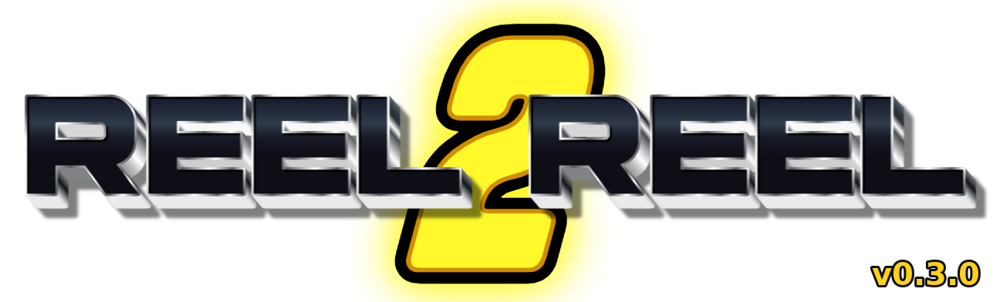

# Reel2Reel — a Wan2GP plugin



A **multi-track timeline video editor** inside Wan2GP. Generate clips with the
Video Generator (or anywhere else), **send them to Reel2Reel**, arrange them on
video/audio tracks, trim and split, then **export a final cut** with ffmpeg.

> ⚠️ **Early build (v0.3.0) — improving fast.** Multi-track video/audio,
> **detach audio from video**, fades/opacity, mute/solo, cross-dissolves,
> undo/redo, **Projects with named-snapshot versioning**, a **global + per-project
> media library**, a **shared right-click menu**, and ffmpeg export all work. The
> in-browser preview is still a single approximate `<video>` (export for the real
> composite). Expect rough edges.

| Sub-tab | What it does |
|---------|--------------|
| **📚 Library** | A **global** (cross-project) and a **per-project** media bin, plus the Wan2GP outputs browser. Send media to either bin from the right-click menu or the outputs browser; add bin clips to a video/audio track. |
| **🎞 Timeline** | A real multi-track canvas: drag/trim, ruler scrub, **Space** play, **S** split, snap + zoom-to-fit. Per-clip inspector (gain, fades, opacity, mute), **detach audio**, duplicate, ripple/lift delete, **cross-dissolve** transitions, per-track volume/mute/solo/lock + reorder, **undo/redo**. **Projects**: open/new/save/save-as/rename/duplicate/delete + named version snapshots. |
| **🎬 Render** | Composite the timeline to an mp4 with ffmpeg, preview it, and send the final cut to **Img2Vid** or **Save As**. |
| **⚙ Settings** | Repoint the projects / renders / import-from dirs; check ffmpeg. |

### Projects & Library

- **Projects** — every cut is a named Project (folder under `projects_dir`) with
  full CRUD (open / new / save / **save as** / rename / duplicate / delete) and
  **manual named version snapshots** you can restore at any time.
- **Library** — a persistent **global** media bin (reusable across all projects)
  and a **per-project** bin, alongside the outputs browser. Drag bin clips onto
  the timeline.

### Right-click menu (shared "saintorphan" engine)

Reel2Reel embeds the shared `window.SaintorphanMenu` engine and `announce()`s
itself, so the user's plugins contribute entries to one right-click menu:

- Any image/video in the app → **Reel2Reel Library (global)** / **(project)** —
  drops the media into the chosen bin.
- A timeline clip → **Send to Vid2Vid** (native), plus **Replicant (Reference)**
  / **ImageSuite (Img2Img / Inpaint)** when those plugins are installed (they
  self-register against Reel2Reel's `.r2r-timeline-clip` surface).

### Editor tooling

- **Audio** — every clip has a gain (dB) and fade in/out; tracks have volume, and
  **mute / solo / lock**. **Detach audio** splits a video clip's sound onto its own
  audio track (muting the video's embedded audio) so you can move, trim, fade and
  gain it independently. Audio clips show a waveform.
- **Video** — multi-track overlay (upper tracks composite over lower), per-clip
  **opacity** and alpha **fades**, and **cross-dissolve** transitions between
  adjacent clips (ripples the next clip into an overlap).
- **Editing** — drag-move (lane-locked), edge-trim, razor **split** at the
  playhead, **ripple delete** (closes the gap) vs **delete/lift** (leaves it),
  **duplicate**, grid + edge **snapping**, **zoom-to-fit**, a playback
  **transport** (Space), and **undo / redo** (⌘/Ctrl-Z, ⌘/Ctrl-Shift-Z).

## How clips get here

Two ways:

1. **Library** — anything in your Wan2GP outputs folder shows up; pick one and
   **Add to timeline**.
2. **Send to Reel2Reel** — any other tab can hand a clip over without coupling to
   this plugin:

   ```python
   from reel2reel.inbox import enqueue_clips
   enqueue_clips(state, "/abs/path/to/clip.mp4")   # state = the session state dict
   return gr.Tabs(selected="plugin_Reel2Reel")      # ...on outputs=[main_tabs]
   ```

   When you switch to the Reel2Reel tab, the queued clips drop straight onto the
   timeline — no button press.

## Design notes

- **Data model** emulates [OpenTimelineIO](https://opentimelineio.readthedocs.io/)'s
  frame-rate-aware hierarchy (Timeline → Tracks → Clips) for loss-free,
  interchange-friendly persistence, while the live edit-state is a flat,
  explicit-position clip list that's trivial to drag. Projects save as
  `Reel2ReelProject.1` JSON; canonical `.otio` export is an additive adapter.
- **Timeline UI** is a hand-rolled, no-build, vanilla-JS DOM editor delivered via
  Gradio's on-load `js=` hook, round-tripping state through two hidden textbox
  JSON pipes. Fully offline; no npm, no CDN.
- **Render** is a two-stage ffmpeg pipeline: normalize every trimmed clip to one
  canonical profile, then composite (overlay-onto-canvas for video, `adelay` +
  `amix` + `loudnorm` for audio). Direct ffmpeg, no MoviePy.

The clean `core/` (pure, no Gradio) vs `ui/` (component builders) vs `plugin.py`
(all wiring) split mirrors the [Image Suite](https://github.com/saintorphan/ImageSuite-Wan2GP)
and [Replicant Character Lab](https://github.com/saintorphan/Replicant-CharLab-Wan2GP)
plugins.

## Install

Use the Wan2GP **Plugin Manager → Add from GitHub URL**:

```
https://github.com/saintorphan/Reel2Reel-Wan2GP
```

or clone into `Wan2GP/plugins/Reel2Reel-Wan2GP`, enable it in the plugin list,
and restart WanGP. ffmpeg must be on `PATH` (or set `REEL2REEL_FFMPEG`).

## Directories

Configurable + persisted to `<wan2gp_root>/.reel2reel.json` (override the root
for all of them with `REEL2REEL_DIR`):

| Dir | Default | Purpose |
|-----|---------|---------|
| `projects_dir` | `reel2reel/projects` | saved timelines (`*.r2r.json`) |
| `renders_dir` | `reel2reel/renders` | exported `*.mp4` |
| Import-from | host outputs / `outputs` | read-only source for the Library |

## Logo

Drop banner artwork at `assets/reel2reel_logo.png` (base64-embedded top-right).
`python tools/stamp_version.py` stamps the version badge from `assets/reel2reel_base.png`.

## Status

v0.3.0. **Working:**

- Loads as a Wan2GP tab (**green** tab color-coding) with the shared
  `SaintorphanMenu` right-click engine + `announce('reel2reel')`.
- Multi-track DOM timeline: drag/trim, ruler scrub, zoom + zoom-to-fit, snapping,
  split, add/remove/reorder tracks, playback transport, keyboard shortcuts.
- **Audio editing** — per-clip gain + fade in/out, per-track volume, mute/solo/lock,
  **detach audio from video**, waveforms.
- **Video** — multi-track overlay compositing, per-clip opacity + alpha fades,
  **cross-dissolve** transitions (xfade + ripple).
- **Undo / redo** across browser edits and panel operations.
- **Projects** — CRUD + manual named version snapshots; legacy flat files migrate.
- **Library** — global + per-project media bins + outputs browser; the `inbox`
  send-to mechanism.
- **Right-click menu** — Reel2Reel Library (global/project) on any media; Send to
  Vid2Vid on timeline clips; Replicant/ImageSuite items self-attach when installed.
- Export to mp4 via the two-stage ffmpeg pipeline (normalize → per-track
  concat/xfade overlay-onto-canvas → `adelay`/`amix`/`loudnorm`), verified end-to-end.
- "Send final cut to Img2Vid" (host-permitting) and Save As.

**Deferred:** frame-accurate / multi-clip compositing **preview** in the browser
(the live preview is a single approximate `<video>` — export for the real cut);
ripple/roll/slip/slide trims and JKL transport; equal-power audio cross-fades
(`acrossfade`); keyframeable effects and speed ramps; canonical `.otio` file
round-trip; hardware encoders / two-pass loudnorm.

This is **not** an official plugin — distribute via the Plugin Manager's
add-from-URL flow; don't add it to the bundled `plugins.json`.
